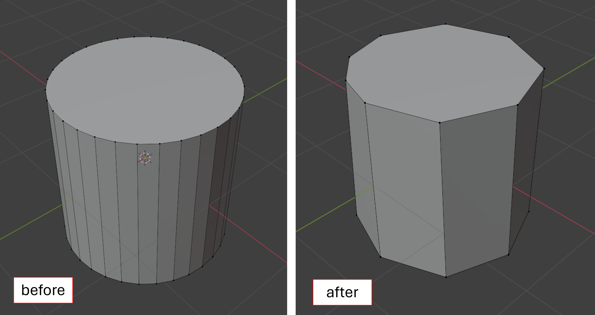

# Improving 3D Model Performance With LOD Control

In the construction industry, 3D models provide a level of visual context that simply cannot be matched through spreadsheets. However, working with them often requires specialized software and heavy-duty hardware. For quick mock-ups and visualizations, one such tool is often overlooked- the humble web browser.

In this paper, I propose a proof of concept whereby 3D models can be hosted on any webpage and viewed on any device with a web browser- no dedicated software needed. I explore the basics of 3D modelling, mesh compression techniques, creating scenes in `three.js`, and swapping between different versions of a mesh depending on how far away the user is from the object.

[The final scene](https://suryashch.github.io/3d_modelling/) contains 303 objects, each with a `low` and `hi` resolution version of their 3D mesh (red and green respectively), that dynamically render to the screen as the user zooms in.

Through the optimizations in this project, I was able to achieve a peak `5x` improvement in GPU performance, and average `3.3x` improvement in webpage performance over the standard 3D model (measured via average frame rate and GPU triangle throughput), all while keeping draw calls constant. The full paper and research body of knowledge can be found [in the body of knowledge repo](https://github.com/suryashch/3d_modelling/blob/main/hosting-3d-model/per-object-lod-control-with-threejs.md).

## 3D Modelling Basics

The fundamental building blocks of 3D models are `vertices`, `edges` and `faces` (typically triangles)[^3]. `vertices` can be thought of as 'corners' while `edges` are what connect the corners to each other. Multiple edges combine to make a loop, known as a `face`. In a cube, we have 8 `vertices` (in black) and 12 `edges` (in red), as can be seen in the image below (in no particular order).

As the total number of `vertices` and `edges` in the scene increase, so does the strain on the GPU and as a result, it becomes laggy when you try to move around. Reducing the number of `vertices` and `edges` in the scene will improve the performance.

One piece of geometry that often goes overlooked in construction models is Piping- modelled as cylinders. Circles don't have any corners- a circle can be thought of as infinitely many corners that all connect to each other. It is impossible to model a perfect circle, so it is approximated using a large number of `vertices`. The more `vertices`, the more the object starts looking like a circle.

Hence, when we extrude all these individual edges and vertices into the page, we get a cylinder (pipe), which is computationally inefficient for how fundamental of a shape it is.

Each one of these edges and vertices need to be kept track of by the computer's GPU. In large models, this is usually what causes the lag. Let's see if we can reduce the total number of edges and vertices in an object.

## Reducing the Density of the Mesh

The `density` of a mesh is a measure of how many individual `vertices` and `edges` exist within it. The density of the mesh can be reduced by removing some `vertices` from it. By removing these data points however, we sacrifice on details and as can be seen in the image below- the finer details of the mesh are lost.

One easy way to reduce the mesh density is using a technique called `Decimate` [^3] in Blender. This modifier will remove `edges` in a mesh upto a specified `ratio`, while maintaining the overall shape of the object. The results below show a test case of `decimating` a 3D mesh model of a human foot [^1] upto a ratio of 0.1.

The mesh has lost a lot of visual quality. But, if we zoom out far enough-

Both meshes look similar. **At far enough distances, mesh quality can be reduced with limited change to visual context.**

## Loading a 3D Model to a Webpage

The JavaScript library `three.js` [^9] provides useful tools for viewing 3D models in a web-based environment. The basic concept behind `three.js` is to create a `scene`, and add objects to it, like `lights`, `cameras`, `backgrounds`, and of course, `3D objects`[^5].

The file format we use for our 3D objects is the `GLTF` [^12] file format. `GLTF` is an open source 3D file format that is optimized for rendering in a web environment.

The 3D model being used for testing is that of a `Piperack` [^2]. The base file size is ~7MB; a relatively small 3D model. The model is loaded to the scene along with some lights, cameras, and spatial grid for reference.

## Basic LOD in three.js

LOD (Level of Detail) modelling involves creating low and high resolution meshes for each object in the scene, and dynamically rendering each one based on how far the object is from the camera [^6]. This way, far-away objects can render in low-resolution, GPU-friendly mode, and near objects can render in their full high definition. Since the total number of `vertices` and `edges` are less in the `low-res` model, switching to these meshes when they are a certain distance away will improve the performance of the scene.

In `three.js`, LOD control is done using the `three.LOD` class [^10]. At a high level, a `LOD` can be thought of as a container that holds meshes. Based on some distance threshold, the `LOD` swaps which mesh is active at any time. In this example, 3 versions of the `human foot` [^1] mesh are created- `hi-res`, `med-res`, and `low-res`, corresponding to 1, 0.4, and 0.1 `decimate ratios` respectively. The meshes have been coloured for identification purposes.

These 3 meshes are loaded into one `LOD` container with distance thresholds of 10 units and 5 units from the camera. Now, zooming into the page changes the active mesh based on the specified distance thresholds [^7].

Let's extend this knowledge out to our `Piperack` model [^2].

## Per Object LOD in three.js

In this section, we replicate our `LOD` results above to a larger 3D model with many more objects. The first step is to create a low-resolution version of the `Piperack` [^2] model at 0.4 `decimate ratio`. For easy identification, the meshes are color coded- `low-res` meshes in `red` and `hi-res` meshes in `green`.

Creating the LODs involves looping through the scene and for each object, saving the `low-res` and `hi-res` meshes to one `LOD` container. This process utilizes a function called `.traverse()` [^11]. Naming of the objects in the scene here is key, as the name is what allows the traversal function to identify the low and high resolution meshes.

A `Map()` object is used to store key-value pairs. Each key in the map contains the Object `name`, and data associated with the high and low resolution mesh. Conceptually, this is what the scene tree looks like after traversing the model.

Each object in the scene is saved to one `LOD` container, and each container contains 2 meshes.

Now upon loading the `LOD` model to the scene, this is what we're greeted with.

The initial load shows all objects rendered in `low-res` mode. Zooming in to specific objects causes them to render in `hi-res`. We measure the performance of the scene against 3 main metrics- `draw calls` (proxy for CPU usage), `triangles` (proxy for GPU usage), and `memory`. Here are some key results.

At a high level 50ft view, only the `low-res` version of the model is active. Hence we observe our best performance improvements, at roughly 5x `triangles` reduction.

The complex geometry of the wellhead in the background is rendered in `low-res` in the dynamic model, significantly reducing the number of `triangles` being tracked by the GPU.

The main Piperack of the scene is loaded dynamically- far away objects in `low-res` while near objects in `hi-res`. This will be on average, the compression capabilities that can be achieved in everyday use.

The full explanation and in-depth analysis of results can be found in the body of knowledge [^8].

## Conclusion

Out in the field, understanding information from drawings is key, and no spreadsheet can compete with the spatial context provided by 3D models. However, a true lightweight, cross platform solution for visualization is lacking. Taking advantage of the web browser allows us to unlock new avenues for data transfer, and with recent advents in cloud computing, what used to be a traditionally computation-heavy resource is starting to look more attainable for the masses.

In further research, I will explore customizing the scene- changing colours, filtering for specific conditions, and running simulations. As well, I explore scaling up- identifying optimizations that can be made to further increase our file size, while limiting the effects on performance.

You can find more information about this research on my [github](https://github.com/suryashch).

## Credits

[^1]: human_foot_model =
  title        = Human Foot Base Mesh,
  author       = ferrumiron6,
  year         = 2025,
  howpublished = SketchFab,
  url          = https://sketchfab.com/3d-models/human-foot-base-mesh-b6dd50f7e87441dca79e24f8c702f84f

[^2]: piperacks_model =
  title        = Pipe Racks Building Blocks Bundle,
  author       = The Learning Network,
  year         = 2020,
  howpublished = Free3D,
  url          = https://free3d.com/3d-model/pipe-racks-building-blocks-bundle-2755.html?dd_referrer=,
  note         = Royalty Free License: https://free3d.com/royalty-free-license

[^3]: analysis_decimate =
  title   = Reducing Mesh Density of 3D Objects in Blender,
  author  = Suryash Chakravarty,
  year    = 2025,
  url     = https://github.com/suryashch/3d_modelling/blob/main/reducing-mesh-density/analysis_decimate.md

[^4]: mean_pooling_on_mesh =
  title   = Mean Pooling Function on a 3D Model,
  author  = Suryash Chakravarty,
  year    = 2025,
  url     = https://github.com/suryashch/3d_modelling/blob/main/reducing-mesh-density/analysis_mean-pooling-on-mesh.md

[^5]: hosting_3d_model =
  title   = Hosting 3D models on a Website,
  author  = Suryash Chakravarty,
  year    = 2025,
  url     = https://github.com/suryashch/3d_modelling/blob/main/hosting-3d-model/analysis_threejs.md

[^6]: superposing_models =
  title   = Superposing Models of Different LOD in a Web Based Environment,
  author  = Suryash Chakravarty,
  year    = 2025,
  url     = https://github.com/suryashch/3d_modelling/blob/main/hosting-3d-model/analysis_superposing-models.md

[^7]: basic_lod_control =
  title   = Basic LOD Control with ThreeJS,
  author  = Suryash Chakravarty,
  year    = 2025,
  url     = https://github.com/suryashch/3d_modelling/blob/main/hosting-3d-model/basic-lod-control-with-threejs.md

[^8]: per_obj_lod =
  title   = Per Object LOD Control With ThreeJS,
  author  = Suryash Chakravarty,
  year    = 2025,
  url     = https://github.com/suryashch/3d_modelling/blob/main/hosting-3d-model/per-object-lod-control-with-threejs.md

[^9]: three.js =
  title   = three.js,
  author  = threejs.org,
  url     = https://threejs.org/docs/

[^10]: three_lod =
  title   = three.LOD,
  author  = three.js,
  url     = https://threejs.org/docs/#LOD

[^11]: traverse =
  title   = three.object3d.traverse(),
  author  = three.js,
  url     = https://threejs.org/docs/#Object3D.traverse

[^12]: gltf =
  title   = gltf,
  author  = Khronos Group,
  url     = https://www.khronos.org/Gltf
