# Improving 3D Model Performance With LOD Control

3D modelling in the construction industry often requires using specialized tools and heavy duty hardware. For quick mock-ups and visualizations, one such tool is often overlooked- the humble web browser.

In this paper, I propose a Proof of Concept whereby 3D models can be hosted on any webpage and viewed on any device with a web browser- no dedicated software needed. I explore the basics of 3D modelling, mesh compression techniques, creating scenes in `three.js`, and swapping between different versions of a mesh depending on how far away the user is from the object.

[Our Final Scene](https://suryashch.github.io/3d_modelling/) contains 303 objects, each with a `low-res` and `hi-res` resolution version of their 3D mesh (red and green respectively), that dynamically renders to the screen as you zoom in.

Through this project, I achieved a peak `5x` improvement in GPU performance, and average `3.3x` improvement in webpage performance over the standard 3D model, all while keeping draw calls constant. The full paper and research body of knowledge can be found [here](../hosting-3d-model/per-object-lod-control-with-threejs.md).

## 3D Modelling Basics

[The fundamental building blocks of 3D models](../reducing-mesh-density/analysis_decimate.md) are `vertices` and `edges`. `vertices` can be thought of as 'corners' while `edges` are what connect the corners to each other. In a cube, we have 8 `vertices` and 12 `edges`, as you can see in the image below (in no praticular order).

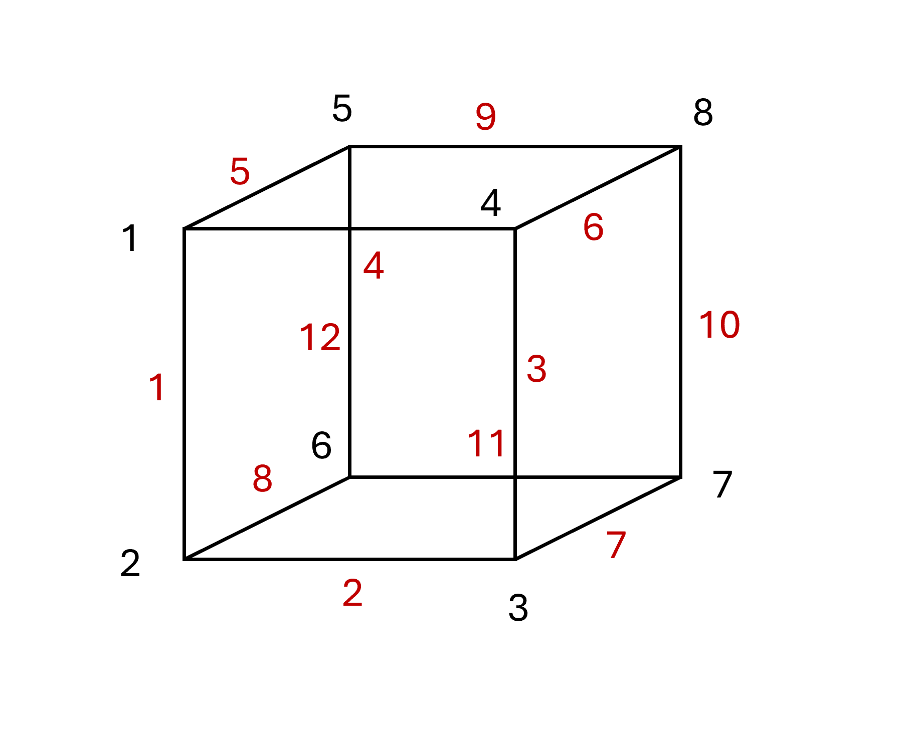

As the total number of `vertices` and `edges` in your scene increase, so does the strain on your GPU and as a result, it becomes laggy when you try to move around. Reducing the number of `vertices` and `edges` in the scene will improve the performance.

One piece of geometry that often goes overlooked in construction models is the humble pipe- modelled as a cylinder. Circles don't have any corners- a circle can be thought of as infinitely many corners that all connect to each other. It is impossible to model a perfect circle, so we approximate it using a large number of `vertices`. The more `vertices`, the more the object starts looking like a circle.

Hence, when we extrude all these individual edges and vertices into the page, we get a cylinder (pipe), which is inefficient for how simple of a shape it is.

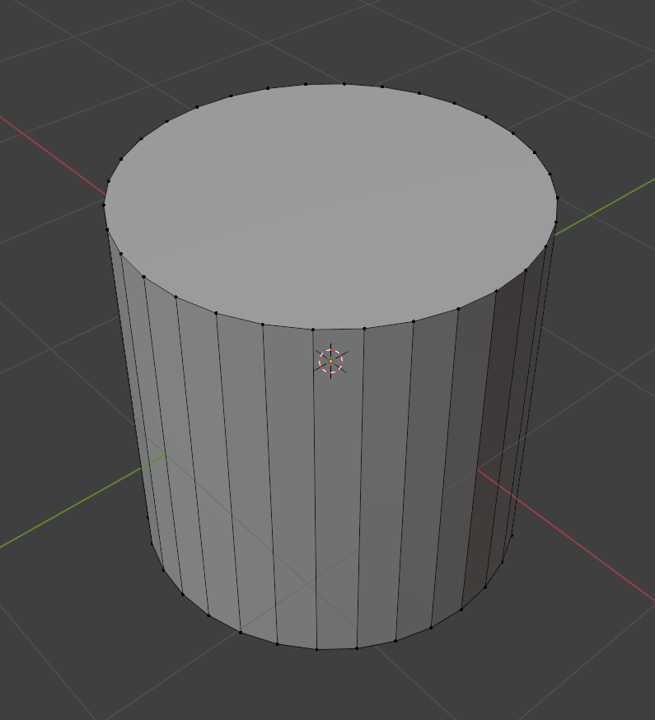

Each one of these edges and vertices need to be kept track of by your computer's GPU. In large models, this is usually what causes the lag- especially when your GPU is not powerful enough. Let's see if we can reduce the total number of edges and vertices in an object.

## Reducing the Density of the Mesh

The `density` of a mesh is a measure of how many individual `vertices` and `edges` exist within it. We can reduce the density of the mesh by removing some `vertices` from it. By removing these data points however, we trade density for details and as you see in the image below, the finer details of our mesh is lost.

Before:

After:

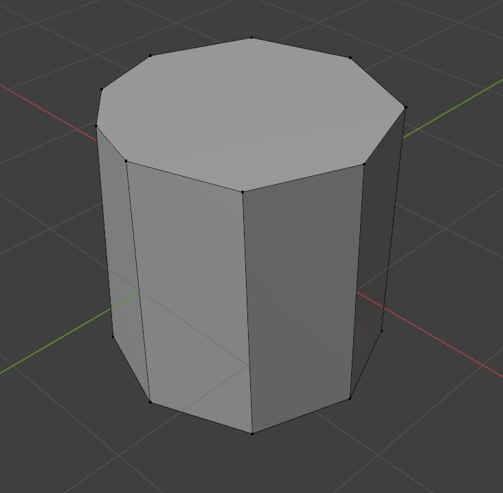

One easy way to reduce the mesh density is using a technique called [`Decimate`](../reducing-mesh-density/analysis_decimate.md) in Blender. This modifier will remove `edges` in a mesh upto a specified `ratio`, while [maintaining the overall shape of the object](../reducing-mesh-density/analysis_mean-pooling-on-mesh.md). Here we run a test case of `decimating` a 3D mesh model of a [human foot] upto a ratio of 0.1.

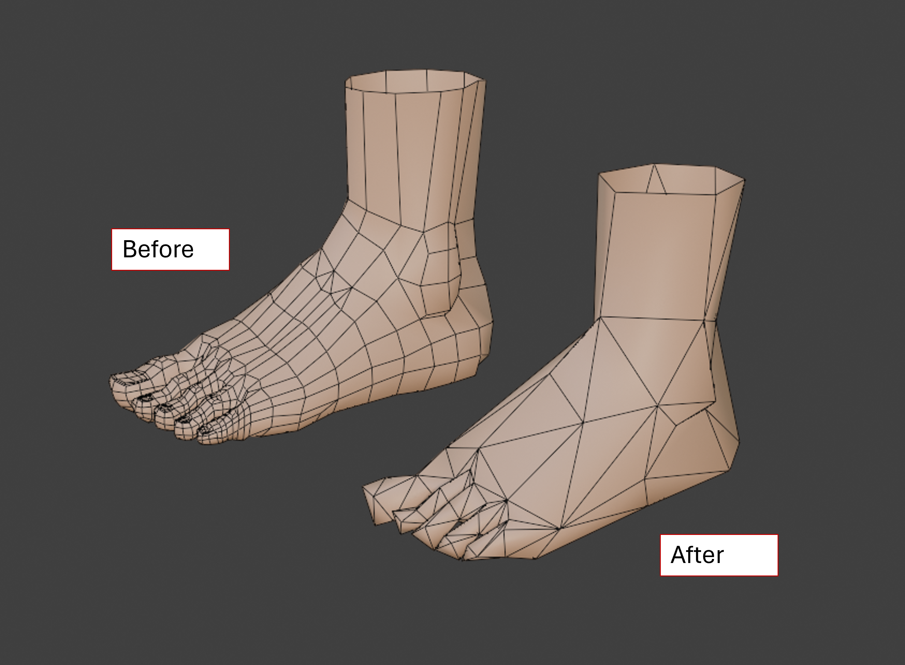

We see that we indeed lose visual quality. But, if we zoom out far enough-

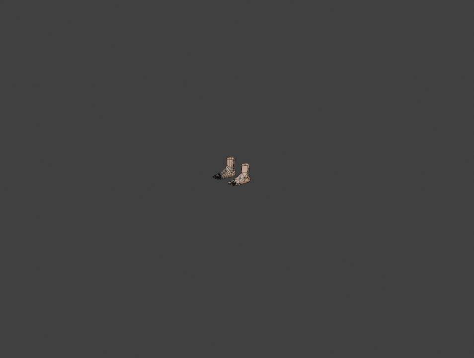

Both meshes look similar. **At far enough distances, mesh quality can be reduced with limited change to visual context.** We proceed with this information.

## Loading a 3D Model to a Webpage

The JavaScript library `Three.js` provides useful tools for viewing 3D models in a web-based environment. [The basic concept](../hosting-3d-model/analysis_threejs.md) behind `Three.js` is to create a `scene`, and add objects to it, like `lights`, `cameras`, `backgrounds`, and of course, `3D objects`.

The file format we will be using for our 3D objects is the [GLTF] file format. GLTF is an open source 3D file format that is optimized for rendering in a web environment.

The 3D model we will be working with is of a `piperack`. The base file size is ~7MB, so definitely a small 3D model. We load it to our scene along with some lights, cameras, and spatial grid for reference.

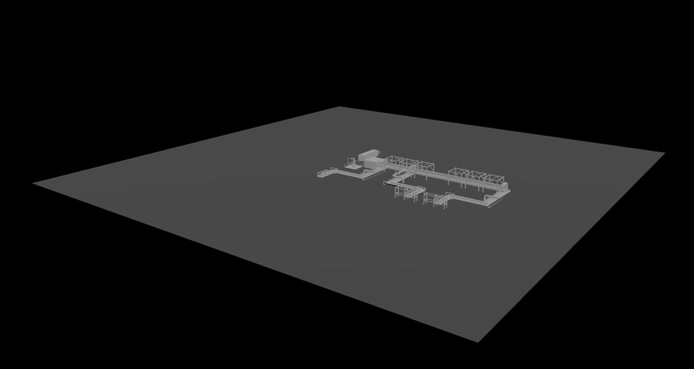

## Basic LOD in three.js

[LOD](../hosting-3d-model/analysis_superposing-models.md) (Level of Detail) modelling involves creating low and high resolution meshes for each object in the scene, and dynamically rendering each one based on how far away the object is from the camera. This way, far-away objects can render in low-resolution, GPU-friendly mode, and near objects can render in their full high definition. Since the total number of `vertices` and `edges` are less in our `low-res` model, we can use this improve the performance of our scene.

In `three.js`, LOD control is done using the `three.LOD` class. At a high level, a `LOD` can be thought of as a container that holds meshes. Based on some distance threshold, the `LOD` swaps which mesh is active at any time. [In this example](../hosting-3d-model/basic-lod-control-with-threejs.md), we load 3 versions of our `human foot` mesh- `hi-res`, `med-res`, and `low-res`, corresponding to 1, 0.4, and 0.1 `decimate ratios` respectively. The meshes have been coloured for identification purposes.

We load these 3 meshes into one `LOD` container and set distance thresholds of 10 units and 5 units from the camera. Now, as we zoom into the page, the active mesh changes at those specified distance thresholds.

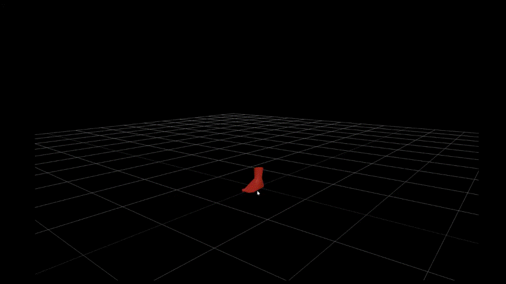

Let's extend this knowledge out to our `piperacks` model.

## Per Object LOD in three.js

We would like to replicate our `LOD` results above to a larger 3D model with many more objects. We create a low-resolution version of our `piperack` model at 0.4 `decimate ratio`. We also colour our `low-res` meshes in `red` and `hi-res` meshes in `green`.

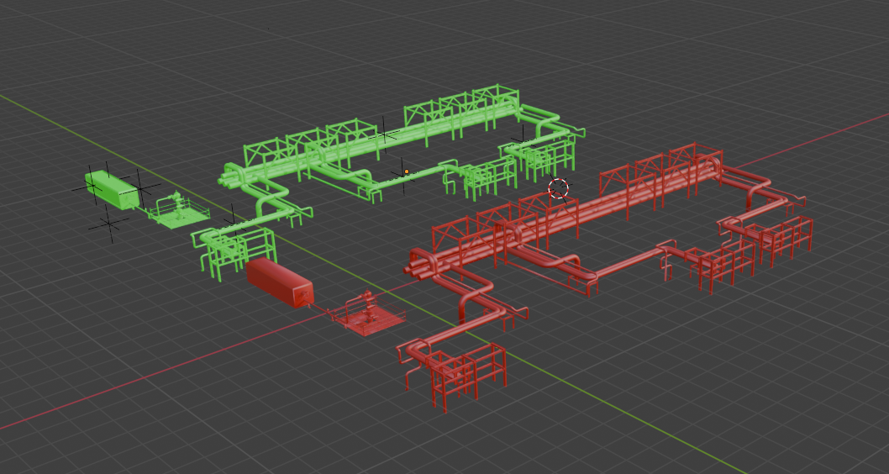

Now, instead of loading our entire model, we need to loop through every object in the scene and for each one, save the `low-res` and `hi-res` meshes to one `LOD` container. This involves using a function called [`.traverse()`](https://threejs.org/docs/#Object3D.traverse). Naming of the objects in the scene here is key, as the name is what allows the traversal function to identify the low and high resolution meshes.

We create a `Map()` to store key-value pairs. Each key in our map contains Object `name`, and the data associated with the high and low resolution mesh. Conceptually, this is what the scene tree looks like after traversing the model.

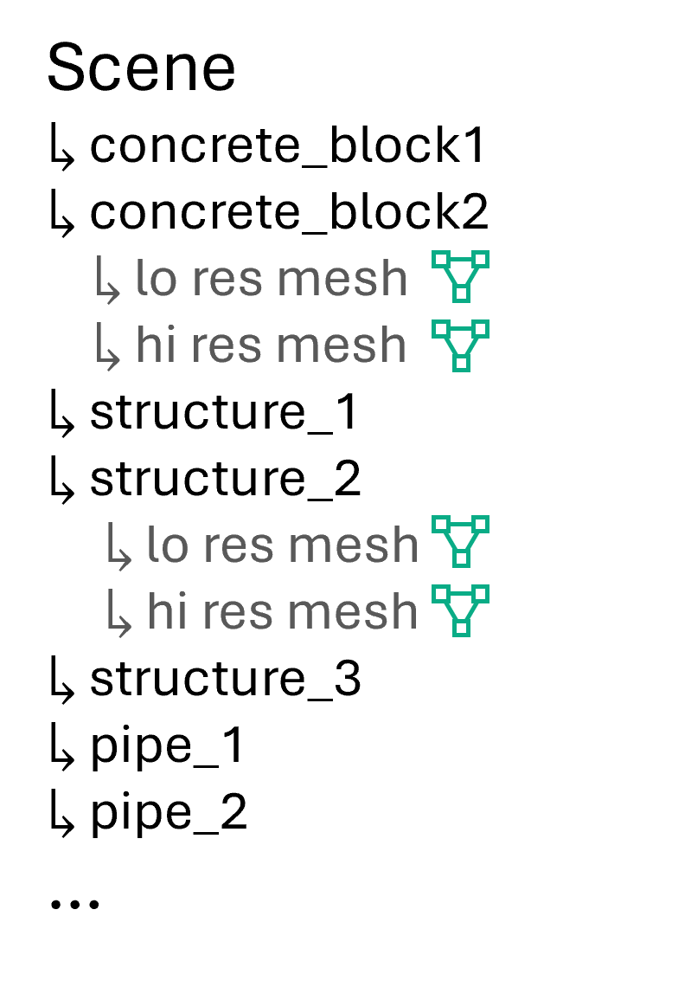

Each object in the scene is saved to one `LOD` container, and each container contains 2 meshes.

Now when we load this dynamic `LOD` model to our scene, this is what we're greeted with.

The initial load shows all objects rendered in `low-res` mode. Zooming in to specific objects causes them to render in `hi-res`. We measure our performance of the scene against 3 main metrics- `draw calls` (proxy for CPU usage), `triangles` (proxy for GPU usage), and `memory`. Here are some key results.

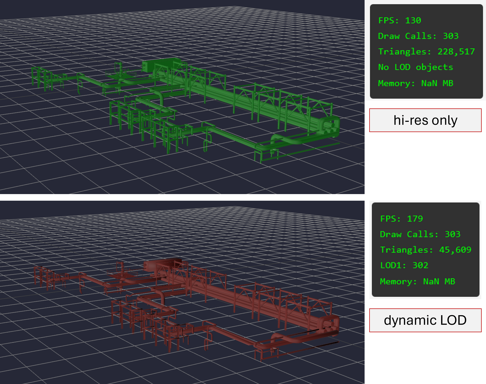

At a high level 50ft view, we only have the `low-res` version of the model loaded to the scene. Hence we observe our best performance improvements, at roughly 5x `triangles` reduction.

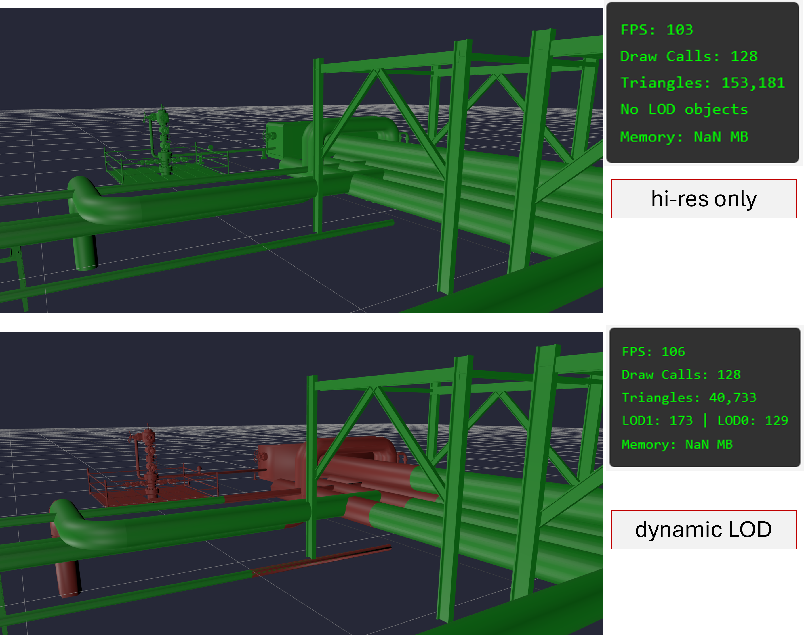

The complex geometry of the wellhead in the background is rendered in `low-res` in our dynamic model, significantly reducing the number of `triangles` being tracked by the GPU.

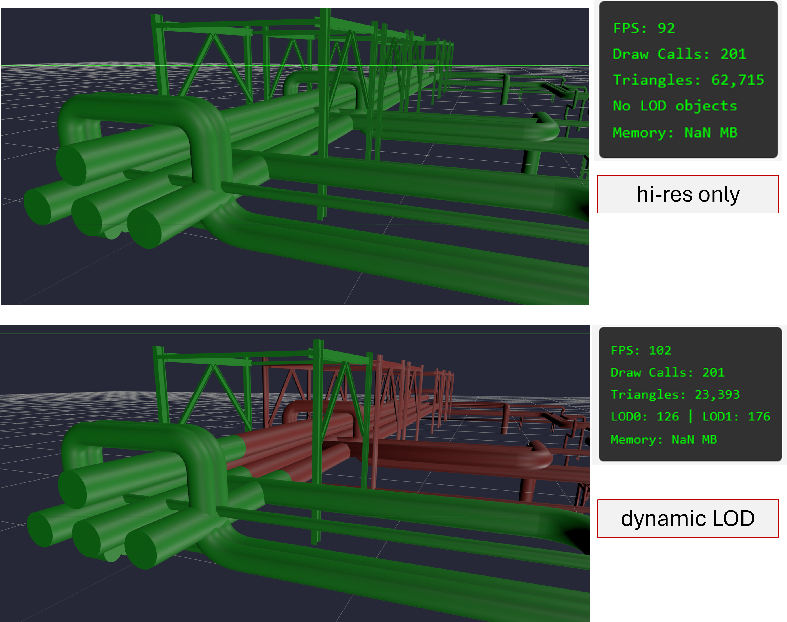

The main piperack of the scene is loaded dynamically- far away objects in `low-res` while near objects in `hi-res`. This will be on average, the compression capabilites that can be achieved in everyday use.

The full explanation and in-depth analysis of results can be found [here](../hosting-3d-model/per-object-lod-control-with-threejs.md).

## Conclusion

Out in the field, understanding spatial context from drawings is key, and no spreadsheet can compare with the spatial context provided by 3D models. However, a true lightweight, cross platform solution for visualizations is lacking. Taking advantage of the web browser allows us.

With the recent advents in cloud computing, this traditionally resource-intensive industry looks 

Web-based GPU engines are more powerful than ever. Utilizing their improved capabilites along with performance boosts like `LOD` control can open the door for viewing larger models on the web. I envision a future where 3D models, regardless of their source, can be quickly downloaded, marked up, edited, and shared with the ease that pdfs have come to achieve. This, I believe, is a step in that direction.

## Credits